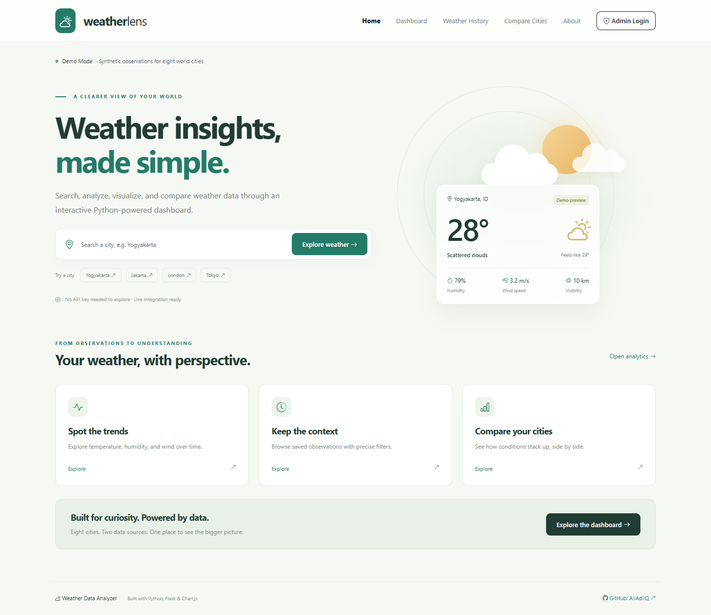
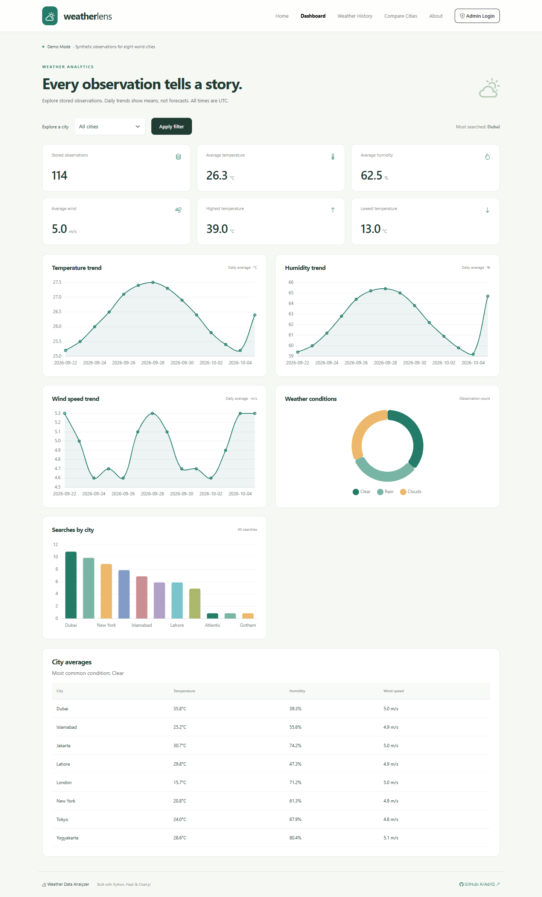
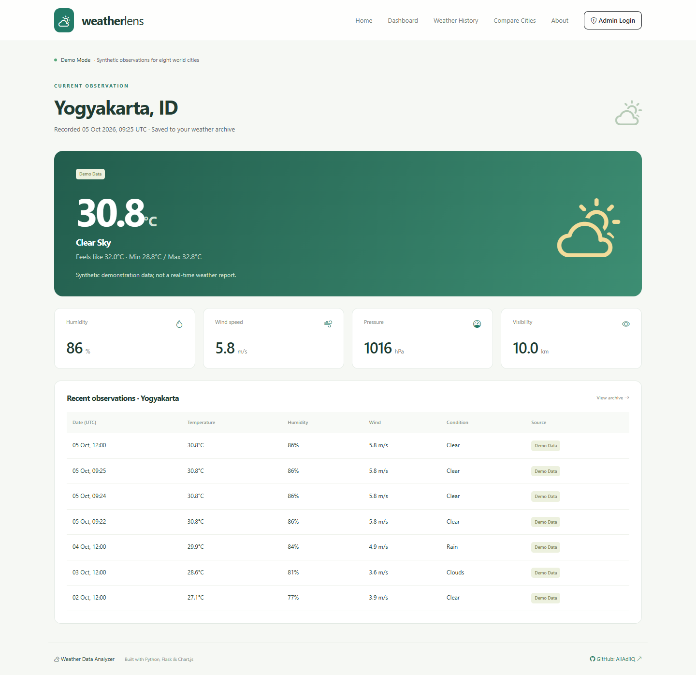
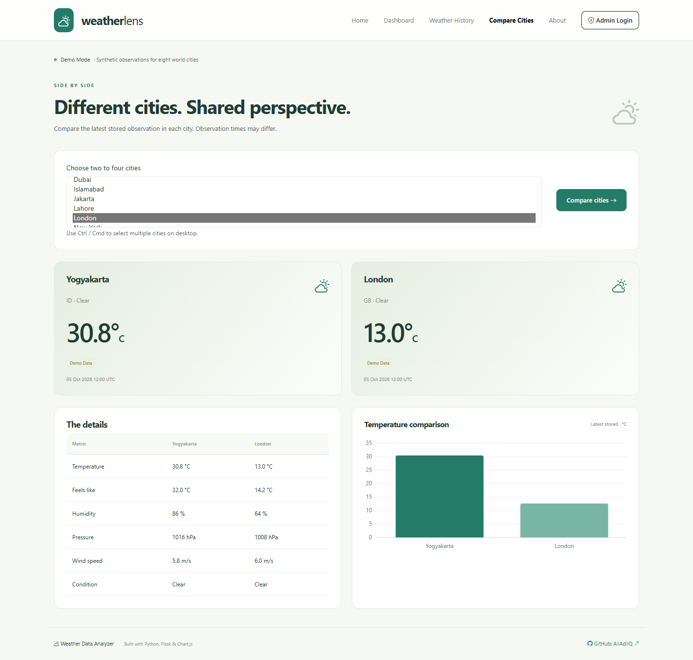
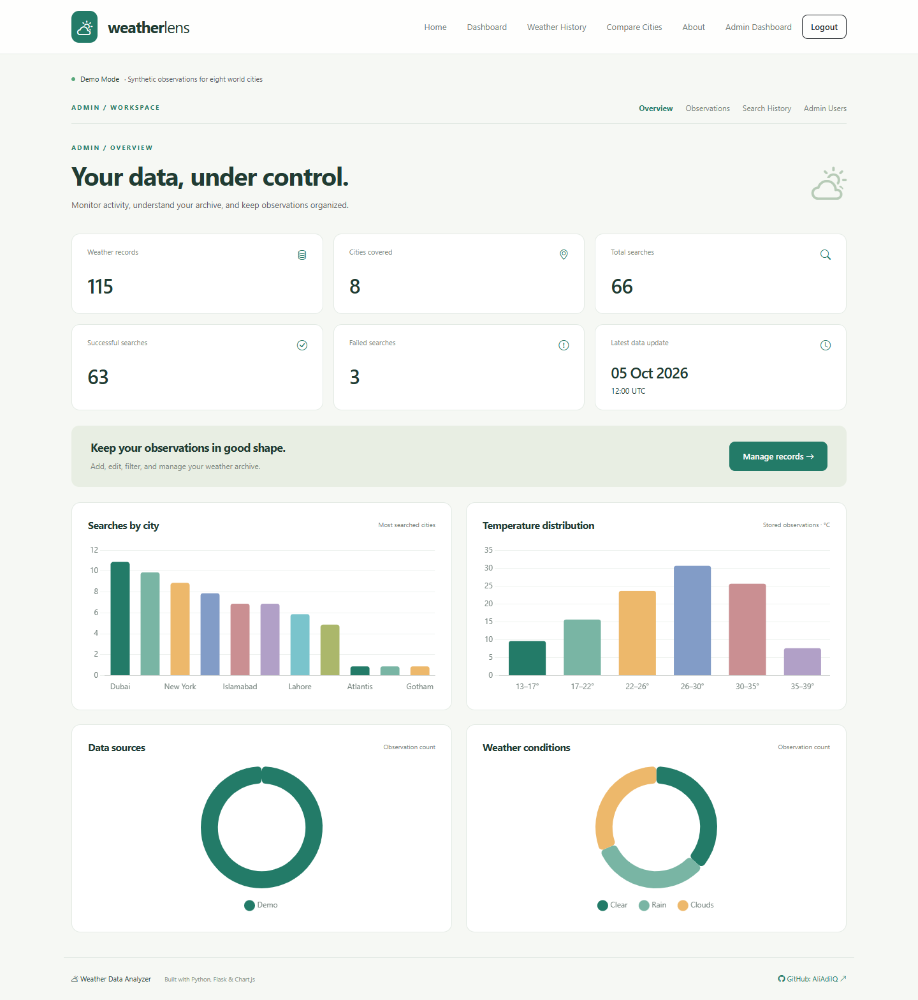

# Weather Data Analyzer


**Weather insights, made simple.** A complete Python and Flask weather analytics portfolio project, with a custom responsive interface, database-backed charts, city comparisons, and a protected administrator workspace.

## Project Overview

Search a city, save an observation, and turn your weather archive into useful insights. The Weatherlens visual identity pairs a calm green palette, CSS weather illustrations, responsive cards, and interactive charts. Live OpenWeather integration and synthetic demo data share the same workflows.

## Features

- City search with temperature, feels-like, min/max, condition, description, humidity, pressure, wind, visibility, country, and UTC timestamp.
- Automatic demo mode without an API key, explicit per-record source badges, and provider-failure fallback for supported cities.
- Pandas and NumPy analytics: temperature extremes, city averages, humidity, wind, common conditions, and popular searches.
- Interactive temperature, humidity, wind, condition, and search charts sourced from SQLite observations.
- Searchable history with city, country, condition, source, sorting, and pagination.
- Compare two to four cities using cards, a metric table, and a chart.
- Custom administrator dashboard, validated observation CRUD, search-history management, and admin directory.
- Hashed passwords, role checks, CSRF protection, friendly error pages, loading states, and delete confirmations.
- Locally bundled Bootstrap, icons, and Chart.js: the demo interface works without a CDN connection.
- Regression tests, GitHub Actions, and repeatable browser screenshot verification.

## Screenshots

### Home Page


### Analytics Dashboard


### Weather Search


### Compare Cities


### Admin Dashboard


See [screenshot generation instructions](screenshots/README.md) to refresh the images.

## Technology Stack

| Layer | Technology |
| --- | --- |
| Backend | Python 3.12+, Flask, blueprints, application factory |
| Database | SQLite, Flask-SQLAlchemy |
| Authentication | Flask-Login, Werkzeug password hashing |
| Forms | Flask-WTF, WTForms, CSRF protection |
| API | Requests, OpenWeather geocoding and current weather |
| Configuration | python-dotenv, environment variables |
| Analytics | Pandas, NumPy |
| Frontend | HTML5, CSS3, JavaScript, Bootstrap 5, Bootstrap Icons, Chart.js |
| Testing | pytest, Playwright browser verification |
| Deployment | Waitress WSGI server |

No React or Node.js runtime is required.

## Project Structure

```text
weather_data_analyzer/
├── app/
│   ├── __init__.py          # Factory and extensions
│   ├── models.py           # User, WeatherRecord, SearchHistory
│   ├── seeding.py          # Repeatable demo fixtures
│   ├── main/               # Public pages and history filters
│   ├── weather/            # Search routes and weather provider
│   ├── analytics/          # Pandas / NumPy services
│   ├── auth/               # Login and logout
│   ├── admin/              # Protected CRUD and management
│   ├── templates/          # Public and admin Jinja templates
│   └── static/             # CSS, JavaScript, licensed vendor assets
├── screenshots/            # Actual page captures and instructions
├── scripts/                # Screenshot capture and asset refresh
├── tests/                  # Routes, authentication, models, services
├── .github/workflows/tests.yml
├── config.py
├── run.py
├── seed.py
├── requirements.txt
├── requirements-dev.txt
├── .env.example
├── .gitignore
├── LICENSE
└── CONTRIBUTING.md
```

The ignored `instance/` directory and SQLite database are created locally.

## Installation

Install **Python 3.12 or newer** first, then:

```bash
git clone https://github.com/AliAdilQ/weather_data_analyzer.git
cd weather_data_analyzer
```

Windows Command Prompt:

```bat
python -m venv venv
venv\Scripts\activate
pip install -r requirements.txt
copy .env.example .env
python seed.py
python run.py
```

Windows PowerShell activation: `venv\Scripts\Activate.ps1`.

Linux/macOS:

```bash
python3 -m venv venv
source venv/bin/activate
pip install -r requirements.txt
cp .env.example .env
python seed.py
python run.py
```

Open [http://127.0.0.1:5000](http://127.0.0.1:5000).

## Environment Variables

| Variable | Purpose | Default |
| --- | --- | --- |
| `SECRET_KEY` | Stable signing key; replace example value | Random ephemeral key if unset |
| `WEATHER_API_KEY` | OpenWeather API key | Empty: demo mode |
| `DATABASE_URL` | SQLAlchemy connection URL | `sqlite:///weather.db` inside `instance/` |
| `DEMO_MODE` | Force synthetic observations even with a key | `false` |
| `COOKIE_SECURE` | Send session cookies only over HTTPS | `false` for local HTTP |
| `FLASK_ENV` | Informational local environment label | `development` in example |

`FLASK_ENV` does not enable Flask debug mode. Generate a signing key with `python -c "import secrets; print(secrets.token_hex(32))"`. An unset secret permits local startup, but changes on restart and invalidates sessions; configure a stable random key for deployment.

## Running the Application

```bash
python run.py
```

Alternatively:

```bash
flask --app run run
```

For a deployment WSGI process:

```bash
waitress-serve --host=127.0.0.1 --port=5000 run:app
```

Place it behind an HTTPS reverse proxy, set a stable `SECRET_KEY` and `COOKIE_SECURE=true`, and provision a private administrator before exposing it publicly.

| Page | Route |
| --- | --- |
| Home | `/` |
| Search | `/weather` |
| Analytics | `/dashboard` |
| History | `/history` |
| Compare | `/compare` |
| About | `/about` |
| Admin login | `/admin/login` |
| Admin overview | `/admin` |
| Manage records | `/admin/records` |
| Search log | `/admin/searches` |
| Admin users | `/admin/users` |

## Demo Mode

No API key is required. Demo mode supports **Yogyakarta, Jakarta, Lahore, Islamabad, London, New York, Tokyo, and Dubai**. Seeding inserts 14 days per city (112 observations), varied humidity/wind/conditions, and successful and failed searches. Data is deterministic synthetic demonstration data, clearly marked in the UI; it is not a historical weather dataset.

Searches save new observations. A failed provider request falls back to demo data for those eight cities. An unsupported demo city returns a friendly validation message. Set `DEMO_MODE=true` to demonstrate locally even with a key configured. Unknown live cities return an error rather than fabricated live readings.

## Demo Admin Account

For local demonstration:

Username: `admin`

Email: `admin@weatherdemo.local`

Password: `Admin123!`

Admin URL: `http://127.0.0.1:5000/admin/login`

> The demo credentials are intended only for local development and demonstration. Change or remove them before deploying the application publicly.

Passwords are stored only as Werkzeug hashes. To change the demo account before deployment, run `flask --app run shell` and enter:

```python
from getpass import getpass
from app import db
from app.models import User
user = User.query.filter_by(username="admin").one()
user.username = input("Private admin username: ").strip()
user.email = input("Private admin email: ").strip()
user.set_password(getpass("New password: "))
db.session.commit()
```

Do not run the demo seed command on a production database afterward: it creates a local demo administrator when the `admin` username is absent.

## Database Setup

```bash
python seed.py
```

Or:

```bash
flask --app run init-db
flask --app run seed-db
```

Seeding does not erase existing data or reset passwords. It adds observations only if no demo records exist. `init-db` creates tables only and does not create accounts. SQLite files are ignored by Git. Back up the database before schema changes; `create_all` is not a migration system.

## Running Tests

```bash
pip install -r requirements-dev.txt
python -m pytest -q
python -m ruff check app config.py run.py seed.py tests scripts
python -m ruff format --check app config.py run.py seed.py tests scripts
```

Tests use a disposable in-memory database and cover public pages, filters, demo searches, live provider mapping, timeout fallback, seed idempotency, analytics, password hashing, login/logout, role protection, CRUD validation, and CSRF enforcement. CI runs the same suite on Python 3.12.

Browser screenshots and layout checks:

```bash
python -m playwright install chromium
python scripts/capture_screenshots.py
```

Run the application in a separate terminal first. [Full capture instructions](screenshots/README.md).

## Weather API Configuration

Create an [OpenWeather account](https://home.openweathermap.org/users/sign_up), obtain an API key, and set `WEATHER_API_KEY` in your ignored `.env`. Restart the application. The service first resolves a city with the geocoding API, then calls [current weather](https://openweathermap.org/current) with latitude, longitude, and `units=metric`. Requests have an eight-second timeout each.

Temperatures are °C, wind speed is m/s, pressure is hPa, and visibility is meters (displayed as km on weather cards). Observation times are UTC. Provider min/max values describe the current observation's city range, not forecast daily extremes. API availability depends on your account, activation, network, and quota. Provider behavior is covered by mocked tests; a real key is not needed for tests.

## Security Notes

- `.env`, databases, caches, and virtual environments are ignored. Never commit real API keys.
- Admin routes require login and the `admin` role; write actions use POST and CSRF-protected forms. Logout uses POST.
- Forms validate field lengths, metric ranges, country codes, observation time, and min/max ordering. Jinja escapes user text.
- Session cookies are HTTP-only and SameSite=Lax. Enable secure cookies over HTTPS.
- Use a random stable secret, private administrator credentials, database backups, HTTPS, and a production WSGI server for public hosting.
- Add reverse-proxy rate limits to login and public weather search before public hosting; each search may consume provider quota and database storage. The app does not implement account lockout or MFA.
- Third-party frontend assets retain their licenses in `app/static/vendor/`. `python scripts/fetch_assets.py` refreshes the pinned copies with an internet connection.

## Future Improvements

- Scheduled observation collection and configurable retention.
- CSV export, date-range comparisons, and timezone preferences.
- Alembic migrations and PostgreSQL deployment support.
- Login throttling, MFA, and additional administrator roles.
- Provider caching and forecast data with clearly distinct visualization semantics.

## Contributing

Contributions are welcome. See [CONTRIBUTING.md](CONTRIBUTING.md) for the workflow and validation requirements.

## License

Released under the [MIT License](LICENSE). Third-party assets use their respective bundled licenses.

## Author

**AliAdilQ**

GitHub: https://github.com/AliAdilQ

Repository: https://github.com/AliAdilQ/weather_data_analyzer
